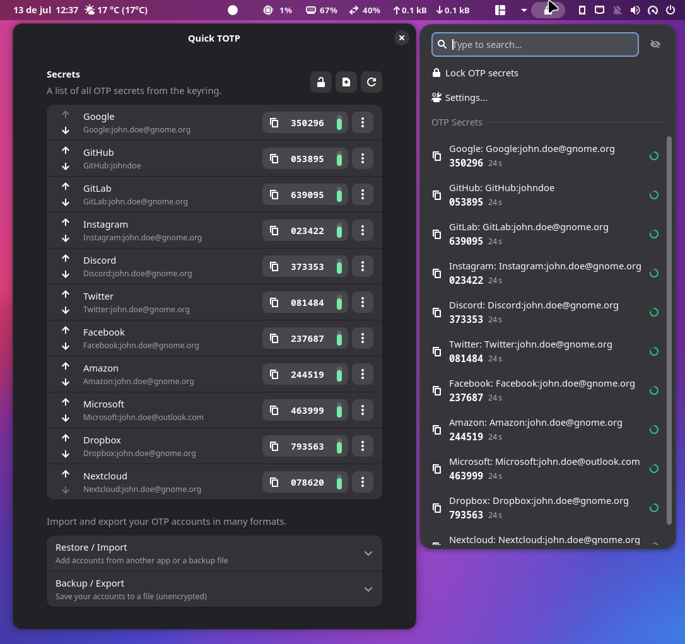

  

  
  
  

# Quick TOTP

**Quick TOTP is an actively maintained GNOME Shell extension that provides secure
and convenient access to TOTP authentication codes directly from the top panel.**
It generates the time-based (TOTP) and counter-based (HOTP) one-time codes used
by services like Google, GitHub, Steam, and many others that support Two-Factor
Authentication (2FA).

## Project Status

Quick TOTP is the actively maintained continuation of the original
[TOTP](https://github.com/dkosmari/gnome-shell-extension-totp) extension by
Daniel Kosmari. Development, bug fixes, and new features happen in this
repository, and contributions are welcome.

For details on how this fork relates to the original project and where to report
issues, please see [DISCLAIMER.md](DISCLAIMER.md).

## Why this fork exists

- The original project provided a solid, well-designed foundation for managing
  OTP secrets securely on the GNOME desktop.
- This fork exists to continue active maintenance and keep the extension working
  smoothly across current GNOME Shell releases.
- Usability improvements and new features will continue to land here.
- Community contributions — issues, translations, and pull requests — are
  welcome.

## Compatibility

| GNOME Shell Version | Status                  |
| ------------------- | ----------------------- |
| 45                  | ✅ Supported            |
| 46                  | ✅ Supported            |
| 47                  | ✅ Supported            |
| 48                  | ✅ Supported            |
| 49                  | ✅ Supported            |
| 50                  | ✅ Supported (verified) |

**✅ Supported** — declared in `metadata.json` and covered by the extension's
version-specific code paths (for example, the `St.ScrollView` API differences
between GNOME 45 and 46+ are handled explicitly).

Packaging and installation were verified locally on **GNOME Shell 50.3**. The
other releases are targeted but not individually re-tested for this fork —
if you run into a problem on any version, please
[open an issue](https://github.com/brunos3d/gnome-shell-extension-totp/issues).

## Features

- **Scrollable OTP list** that stays within the screen height no matter how many
  secrets you have.
- **Instant search / filter** — start typing to narrow the list by issuer,
  account, or any non-secret attribute.
- **Show / hide codes** with a single toggle, so codes stay masked until you
  need them.
- **Live countdown** on every TOTP entry, showing the remaining seconds and a
  subtle progress ring.
- **Full keyboard navigation** — the search field is focused automatically, and
  Arrow keys, Tab, Enter, and Escape all work as expected.
- **TOTP and HOTP** support, including custom digits, periods, and algorithms.
- **Import & export in many formats** — Aegis, andOTP, FreeOTP+, Bitwarden,
  GNOME Authenticator, Google Authenticator, Raivo OTP, `otpauth://` URIs, QR
  codes, and Quick TOTP's own JSON (see
  [Import & Export](docs/import-export.md)).
- **Secure by design** — secrets are stored in the GNOME Keyring and wiped from
  memory immediately after use (see [Security](#security)).

## Security

The OTP secret is stored in the [GNOME
Keyring](https://wiki.gnome.org/Projects/GnomeKeyring), in a separate collection
called "OTP". For improved security, users can lock this collection with its own
password.

During normal usage, the extension will load the specific OTP secret (unlocking
the Keyring if necessary), copy the authentication code to the clipboard, and
immediately wipe the OTP secret from memory.

In the preferences window, sensitive data (the `otpauth://` URIs) are
automatically erased from the clipboard after a few seconds (30 by default).

## Installing from GNOME Shell Extensions website

Quick TOTP has its own extension identity, so it will be published as a separate
listing on the [GNOME Shell Extensions website](https://extensions.gnome.org/).
Until that listing is available, please install from source using the
instructions below.

## Installing from sources

Prerequisites:

- [make](https://www.gnu.org/software/make/)

- [jq](https://stedolan.github.io/jq/)

- glib2-devel (Fedora) or glib2.0-common (Mageia) or libgio-2.0-dev-bin
  (Ubuntu): whatever is the package that provides the
  `glib-compile-resources` tool.

Run:

    git clone https://github.com/brunos3d/gnome-shell-extension-totp.git
    cd gnome-shell-extension-totp
    make install

Then log out and back in (or restart GNOME Shell) and enable **Quick TOTP** with
your preferred extensions manager.

## Migrating from the original TOTP extension

Quick TOTP reads OTP secrets from the same GNOME Keyring collection and using the
same libsecret schema as the original extension, so **your existing secrets are
discovered automatically** — there is nothing to export or re-import.

Because Quick TOTP installs as a distinct extension, only the small set of
preferences (the QR-code helper commands and the clipboard-clear delay) start at
their defaults; adjust them in the preferences window if you had customized them.
You may keep both extensions installed side by side, but to avoid duplicate panel
indicators it is recommended to disable the original once Quick TOTP is enabled.

## Import & export

Quick TOTP can move accounts in and out of the wider OTP ecosystem. Open
**Settings → Backup & Restore** to import from a file (the format is
auto-detected) or export a backup.

Supported imports include **Aegis, andOTP, FreeOTP+, Bitwarden, GNOME
Authenticator (current and legacy), Google Authenticator, Raivo OTP**, `otpauth://`
URIs (single, multiple, and QR), URI-list files, and Quick TOTP's own JSON.
Exports include Quick TOTP JSON, an `otpauth://` URI list, GNOME
Authenticator / andOTP, Aegis, and FreeOTP+.

Encrypted backups are intentionally not supported (a shell extension has no AES
available); export an unencrypted variant instead. See the full
**[Import & Export guide](docs/import-export.md)** for the compatibility matrix,
examples, limitations, and security notes.

It's also possible to import and export single OTP secrets that conform to
[Google's Key URI Format](https://github.com/google/google-authenticator/wiki/Key-Uri-Format),
compatible with applications like Google Authenticator, FreeOTP, Authy, etc.

## Scanning QR codes

It's possible to scan QR codes from a camera and from the clipboard, if you have
the [ZBar](https://zbar.sourceforge.net/) package installed. In some distros
(like Debian and Ubuntu) the package is named `zbar-tools`.

## Exporting QR code

It's possible to export the OTP secret as a QR code to be scanned into other
devices, if you have the [qrencode](https://fukuchi.org/works/qrencode/) package
installed.

## Importing Steam Guard secret

You can generate Steam Guard Mobile Authenticator codes, by importing the
"shared secret" from your Android phone.

See the [Steam Guard](steam.md) document for more details.

## Related extensions

When using this extension on a laptop, it's a good idea to also install [Keyring
Autolock](https://extensions.gnome.org/extension/6846/keyring-autolock/). It will
ensure your Keyring gets locked after a period of time, so you never forget to
keep your OTP secrets protected.

## Contributing

Bug reports, feature requests, translations, and pull requests are welcome. Open
an issue or pull request in this repository.

## Credits

Quick TOTP is a fork of the original
[gnome-shell-extension-totp](https://github.com/dkosmari/gnome-shell-extension-totp)
by Daniel Kosmari, whose work made this project possible. See
[AUTHORS](AUTHORS) for authorship details.

The import/export subsystem was designed after studying
[GNOME Authenticator](https://gitlab.gnome.org/World/Authenticator)
(GPL-3.0-or-later): its backup architecture, supported formats, and Backup &
Restore workflow guided this feature, and some of its test fixtures are reused to
verify compatibility. No code was copied verbatim; the concepts were
re-implemented for Quick TOTP's architecture. With gratitude to Authenticator's
authors and contributors. Details and attribution are in
[docs/import-export.md](docs/import-export.md).

## License

Quick TOTP is free software, distributed under the terms of the GNU General
Public License, version 3 or later (GPL-3.0-or-later). See [COPYING](COPYING) for
the full license text.
